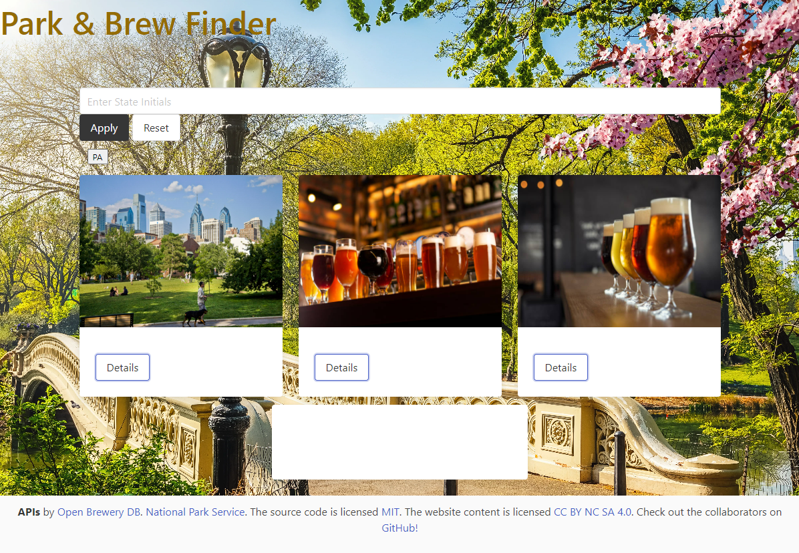

# park-brew-finder-app

## Description 

This project was a collaborative work among student developers. We wanted to create an application that would help the user find new places in nature to explore and new locales to experience. The application allows the user to enter any US State initials and search the National Park Service register to return a random State Park or Historic Site along with two local breweries. This app is useful for providing ideas for different places to visit. This concept allows the user a macro perspective of their experience rather than a focus on minute detail.

We chose the CSS Framework Bulma because it is lightweight and platform independent with good documentation support. Both the National Park Service API and the Open Brewing DB API were chosen due to reliability, good documentation and ease of use.

We faced some challenges with the intial brewery mapping API we chose in terms of reliability and consistent returns using the selected parameters. Opting for the more robust Open Brewing DB API resolved these issues.

In the future, some features we'd like to implement would be additional search parameters such as zipcode and amenities. We would like to add a trip routing function.

## Usage

[Click here for live website](https://jjsdunc88.github.io/park-weather-app/)

## Development Team

[Luke Antonello](https://github.com/l-antonello)

[John Dawson](https://github.com/MilkyRamen)

[Jake Duncan](https://github.com/jjsdunc88)

[Yandra Kamberaj](https://github.com/yankamb444)

## Credits

BootCamp Tutor Andres Long

TA Andrew Read

TA Tom Woods

Instructor Anthony Maddatu

Shamus Field

[Myro Lee](https://github.com/myrojoylee)

## License

Please refer to the LICENSE in the repo.

